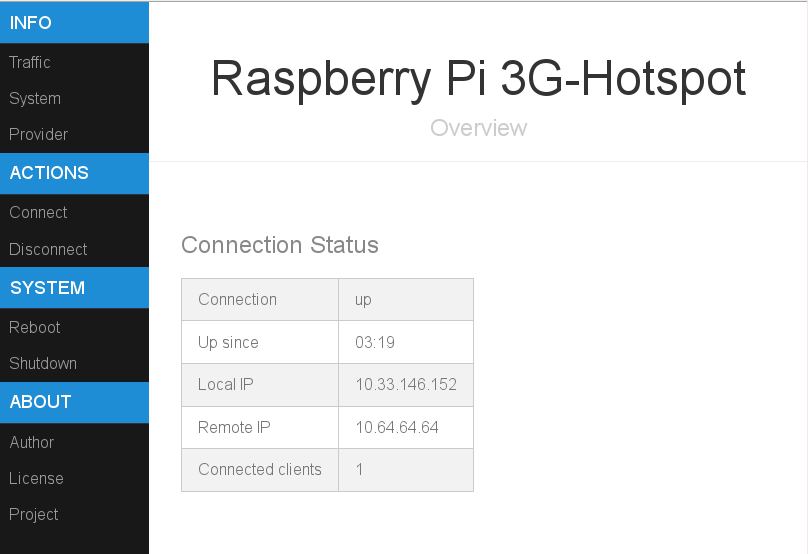

Installation
============

Introduction
------------

This is a step-by-step installation instruction. It describes what you have
to do to turn your Pi into a combined router/access-point. Please follow
the steps exactly as possible.

In case you have problems, search the internet. Posting in the project area
here on Github probably won't help you, since I just don't have the time to
monitor the messages.

Prerequisites
-------------

Since we will plugin an UMTS USB-stick and a WLAN USB-stick into the Pi, you
should use a Pi Model 2 or at least a Pi Model 1B+. This is because both
sticks together draw more current than the Model 1B can provide. Your
wall plug or mobile power supply should also be stable and provide 2A or
above.

UMTS-sticks are widely available. Before you proceed, you should verify that
it is supported by Linux. Most older sticks are well supported, but this
is not guaranteed.

Also make sure that your WLAN dongle also runs in access-point mode.

As a basis, you should install a standard Wheezy Raspbian, boot it and
do basic initial configuration. The minicomputer should also be
connected to the internet, since we need to install some software packages.

Install necessary software
--------------------------

Run the following comands to install the necessary software:

    sudo apt-get update
    sudo apt-get install \
      usb-modeswitch usb-modeswitch-data \
      bridge-utils \
      ppp wvdial \
      hostapd iw dnsmasq \
      vnstat \
      lighttpd php5-cgi phpsysinfo
   

Copy Files
----------

After (!) installation of the software, copy the content of the
**files**-directory to your system:

    rsync -avz files <ip-or-hostname-of-your-pi>:/tmp

Be careful, don't add a slash after "files"!

Afterwards, login to your pi and copy the files to the correct destination:

    sudo rsync -avz /tmp/files/ /

Note that you need the slash after the files here! If you know how to do
it, you can enable root-login and just use a single rsync-command for the job.

    rsync -avz files/ root@<ip-or-hostname-of-your-pi>:/

As a last step, you have to fix the access-rights for the files you just
copied. Run

    sudo /usr/local/sbin/fix-rights

Check the UMTS-Stick
--------------------

Now plugin your UMTS USB-stick. Wait a few moments and the check if you
have a new device called `/dev/ttyUSB0`. If not, examine `/var/log/messages` to
see what has happened.  You should find some messages which identify your
stick. Use this information to search the internet if your stick is
really supported by Linux.

Configure wvdial
----------------

We assume that the stick is supported and that the device /dev/ttyUSB0
exists. In this step, we configure the dialer program wvdial using

    sudo wvdialconf

This will update the section "[Dialer Defaults]" in `/etc/wvdial.conf`.
Now configure the section "[Dialer umts]" to your needs
(phone-number, apn name and so on).

**Configure the correct PIN in the section "[Dialer pin]"!**

Note that you can have sections for more than one provider in this
file. The three sections above are used in other configuration files and
scripts, therefore you should not change the name of these sections
unless you know what you are doing.

To test the dialer, enter

    sudo wvdial pin
    sudo wvdial umts

The last command should start dialing and configure a PPP connection to
your provider. Sometimes the dialer needs additional configuration,
please refer to the documentation of wvdial for available options. If the
PPP-daemon starts, enter the command

    ifconfig ppp0

in a new window. This should give you details about the configured connection.
You can stop the daemon by pressing CTRL-C in the first window.

Configure Networking
--------------------

The sample network configuration file in `/etc/network/interfaces` will
automatically load some pre-defined firewall rules. These rules will
guard your system and will also later forward packages from the internet
to your local net. Kernel-level forwarding is also activated in the
file `/etc/syscntl.conf`.

If you know what you are doing, you can change the rules in
`/usr/local/sbin/setup-iptables` and rerun this comand once.

The network configuration will create a bridge for the internal network
(details below) and a connection to the internet using wvdial.
You should be able to start the internet connection with

    sudo ifup ppp0

and terminate it with

    sudo ifdown ppp0

The internal network will use the ip address-range from
192.168.100.1-192.168.100.254. **The router will have the address
192.168.100.250**. If necessary, change these values to your needs.

Configure Access-Point
----------------------

To configure the access-point, run

    sudo iw wlan0

If this command gives you some detailed information, then your WLAN dongle is
supported by Linux out-of-the-box. You only have to edit the file
`/etc/hostapd.conf` (change the ssid and the channel to a suitable value
and set the WLAN-password to a new value). Don't restart your Pi yet!

Some Realtek based WLAN-chips (e.g. the small and cheap Edimax
EW-7811UN) need a different version of hostapd. A version suitable for
the widely used chip RTL8192 is located in `/usr/local/sbin/hostapd`.
In this case, move `/etc/init.d/hostapd.rtl8192` to `/etc/init.d/hostapd` and
move `/etc/hostapd.conf` to `/etc/hostapd.conf.rtl8192`.

Configure DNS and DHCP
----------------------

We installed the software dnsmasq and this will take care of DNS (name
resolution) and DHCP (IP addresses). You can find the configuration in
`/etc/dnsmasq.conf`. If you did not change the network addresses in
`/etc/network/interfaces`, there is no need to edit this file. Otherwise,
make sure the ip-ranges from dnsmasq fit into the configured network.

Since dnsmasq is a DHCP-server, we can shutdown the DHCP-*client* which
is running on the Pi:

    sudo update-rc.d -f dhcpcd remove

Test the setup
--------------

At this point the basic setup is done. You should now remove any
(wired) connections from the Pi to you home network and reboot the
system. After booting, the system should provide a new independent
network, either by ethernet cable or by WLAN as configured above.

Start the connection to the internet on the Pi with

    sudo ifup ppp0

You should now be able to access the internet from all clients
connected to your Pi.

Track Network-Traffic
---------------------

To monitor traffic, we use vnstat. Since during installation the wan-interface
ppp0 was not yet available, you have to initialize the database once.

If not already done, connect to the internet using

    sudo ifup ppp0

Afterwards, initialize the database with

    sudo vnstat -u -i ppp0

From now on, you can monitor the network usage with

    vnstat

or more specific

    vnstat -i ppp0

Later on, we will install a simple webfrontend for viewing the data.

Setup Webserver
---------------

In the first step, we installed the small webserver lighttpd and support
for PHP. At this point, we will configure lighttpd to use PHP:

    sudo lighttpd-enable-mod fastcgi-php
    sudo /etc/init.d/lighttpd force-reload

You should now be able to access the default homepage with the link
http://192.168.100.250.

Add PHP-Sysinfo
---------------

Link php-sysinfo into our "web-space":

    sudo ln -s /usr/share/phpsysinfo /var/www/sysinfo

Add PHP-Vnstat
--------------

Run the following commands to setup the PHP frontend for vnstat (you might
have to change the version number):

    wget http://www.sqweek.com/sqweek/files/vnstat_php_frontend-1.5.1.tar.gz
    sudo tar -xvzpf vnstat_php_frontend-1.5.1.tar.gz -C /var/www
    sudo mv /var/www/vnstat_php_frontend-1.5.1 /var/www/net
    sudo chown -R www-data:www-data /var/www/net

Then copy files from `/var/www/net.add` to `/var/www/net/`:

    sudo cp -a /var/www/net.add/* /var/www/net

Edit `/var/www/net/config.php` to suit your needs (set variables
`$locale, $language, $iface_list, $iface_title[xxx]`).

You can now access the traffic from your browser using

    http://<ip-or-hostname-of-your-pi>/net

Configure Web-Control
---------------------

The system provides a simple web interface to control the hotspot
.

You can navigate to the page with 
    
    http://<ip-or-hostname-of-your-pi>/hotspot

The page links to the php-sysinfo pages and to the php-vnstat pages as well
as to your provider (configure the link in the file 
`/var/www/hotspot/index.html`).

The web page provides the following services:
  - shutdown the system
  - reboot the system
  - connect
  - disconnect

The web-page is not in any way secured, every user in the local network can
access the page. If you don't like that, you have to enable authentication
for lighttpd (search the web for a tutorial).

Note that the user running the lighttpd-deamon (named "www-data") needs
special privileges to provide the above services. These privileges are
configured in `/etc/sudoers.d/www-data`.
